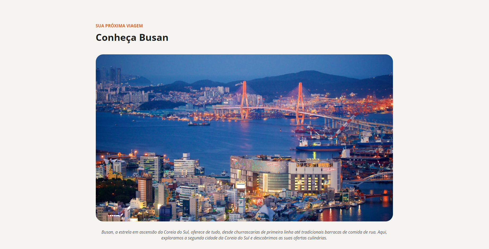

<h1 align="center">Desafios Web</h1>

Aqui estarei adicionando meus projetos desenvolvidos com desafios fornecidos pela Rocketseat, principalmente as landing pages.

 

# 🚀 Tecnologias
Projetos desenvolvidos com as seguintes tecnologias:
<ul>
  <li>HTML e CSS</li>
  <li>JavaScript</li>
  <li>Git e Github</li>
  <li>Figma</li>
</ul>

 

<h2>Desafios</h2>

Desafio 1: Tourist Place - <a href="https://lukasrib15.github.io/web-projects/tourist-place/">Acesse landing page</a> 

Tecnologias usadas:

 

